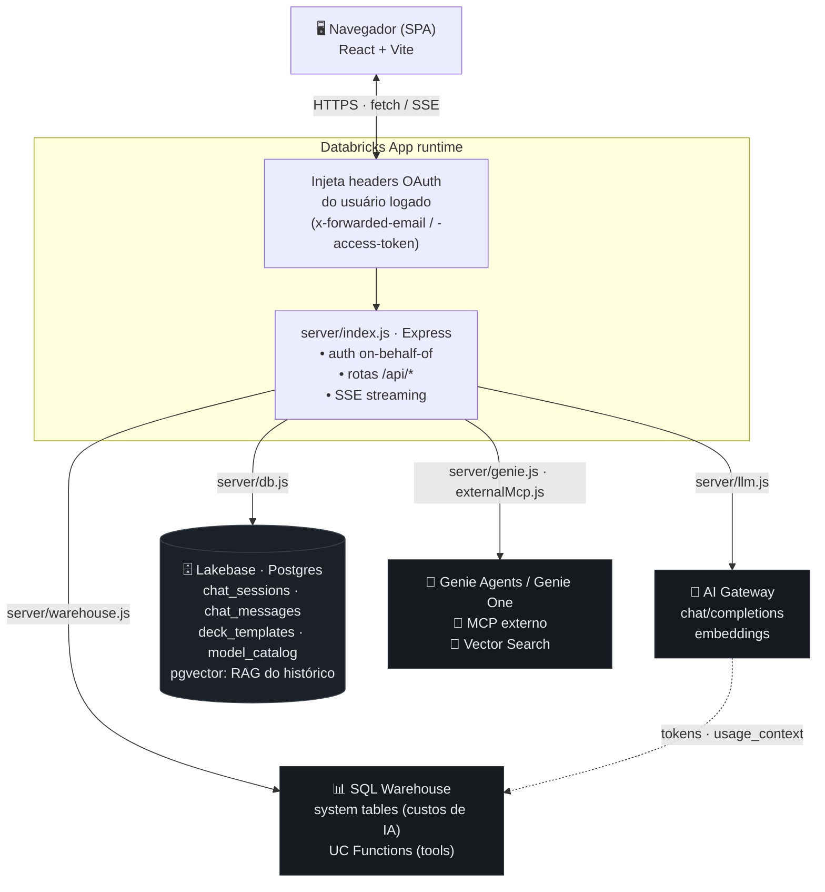

# AI Prism

[](LICENSE)
[](.nvmrc)
[](CONTRIBUTING.md)

Ambiente de chat multimodelo construído como **Databricks App**, que expõe uma interface
única para conversar com diversos LLMs (Anthropic, OpenAI, Google, Meta, Alibaba, Zhipu)
servidos pelo **Databricks AI Gateway**, com histórico persistido em **Lakebase (Postgres)**
e autenticação on-behalf-of do usuário logado no workspace. Além do chat, gera artefatos
reais editáveis — apresentações `.pptx`, planilhas `.xlsx`, documentos de texto (DOCX/MD/PDF),
imagens e gráficos interativos —, aceita imagens como entrada (colar/anexar → visão e edição)
  e chama ferramentas nativas do workspace (Genie, Python, busca/leitura da web, Vector Search, UC Functions, MCP externo).

## Visão geral

- **Frontend**: SPA em React 18 + Vite + Tailwind CSS.
- **Backend**: servidor Express (Node 22+) que faz proxy autenticado para o AI Gateway e
  persiste sessões/mensagens no Postgres.
- **Modelos**: acessados via endpoint OpenAI-compatible do AI Gateway
  (`/serving-endpoints/chat/completions` e `/serving-endpoints/embeddings`), sem SDKs de
  provedor — apenas `fetch`.
- **Persistência**: Lakebase Postgres — o app conecta como o **service principal** dele
  (um único role PG serve todos os usuários; o isolamento é app-level por `WHERE user_email`).
- **Deploy**: roda como Databricks App (`app.yaml`), servindo o build estático do client a
  partir do próprio processo Express.

## Arquitetura

O servidor Express é a única porta de entrada. Ele chama o AI Gateway, o Genie, o Vector
Search e as UC Functions *on-behalf-of* do usuário logado (com o token OAuth dele); o
Lakebase é a exceção — o app conecta como o **service principal** dele, com isolamento
app-level por `WHERE user_email` (ver abaixo).



> O diagrama acima usa [Mermaid](https://mermaid.js.org/) (renderizado nativamente
> pelo GitHub). A seta pontilhada AI Gateway → SQL Warehouse indica que o consumo de
> tokens de cada chamada ao gateway é gravado nas *system tables*, de onde o
> **dashboard AI/BI de custos** (ver [`dashboards/`](dashboards/)) lê o custo real
> faturado (DBU × preço) por usuário — fora do app, para que nenhuma consulta pesada
> ao warehouse trave a UI.

### Autenticação (on-behalf-of + service principal)

Em produção, o runtime da Databricks App injeta em cada requisição os headers
`x-forwarded-email` e `x-forwarded-access-token` do usuário autenticado no workspace. O
servidor usa esse token do usuário (*on-behalf-of*) para tudo que deve respeitar as
permissões dele: **AI Gateway**, **Genie**, **Vector Search**, **UC Functions** e **MCP
externo** (`Authorization: Bearer <token>`).

O **Lakebase é a exceção**: o app conecta como o **service principal dele** (o runtime
injeta `DATABRICKS_CLIENT_ID`/`DATABRICKS_CLIENT_SECRET`; ver `server/db.js`). Um único role
Postgres serve todos os usuários, e o isolamento por usuário é **app-level** (cláusulas
`WHERE user_email` em todas as queries) — é isso que torna o app genuinamente multiusuário
sem precisar de um role PG por pessoa. Como o token do SP sobrevive à rotação, as conexões
são **pooladas** (`spPool`): só a primeira operação de um pool frio paga o handshake. O role
PG do SP é criado no deploy pelo job de auto-config (`databricks_create_role`); a conexão via
token OAuth do usuário como senha existe apenas como fallback e no dev local.

Em desenvolvimento local, na ausência dos headers, o servidor cai para
`DATABRICKS_USER_EMAIL` / `DATABRICKS_USER_TOKEN`, e para o Lakebase use `PGHOST` +
`PGPASSWORD` (uma credencial de banco dedicada).

### Fluxo de uma mensagem de chat

1. O client envia `multipart/form-data` para `POST /api/chat` (prompt + anexos opcionais).
2. O servidor extrai texto de qualquer anexo (`server/files.js`) e monta o histórico da
   sessão a partir do Postgres.
3. A resposta é transmitida como **Server-Sent Events** (`text/event-stream`) token a
   token, repassando o streaming do AI Gateway diretamente para o navegador.
4. Ao final, a mensagem do assistente (com contagem de tokens) é persistida, o embedding
   de busca semântica da sessão é recalculado, e — na primeira troca — um título
   (emoji + poucas palavras) é gerado automaticamente por um modelo rápido.

## Estrutura do projeto

```
ai-prism/
├── app.yaml                # manifesto da Databricks App (comando, env, escopo OAuth)
├── server/
│   ├── index.js             # rotas Express, SSE, auth on-behalf-of, loop de tools
│   ├── llm.js                # catálogo de modelos + client do AI Gateway (chat/embeddings)
│   ├── db.js                 # schema e queries do Lakebase (sessões/mensagens/decks/planilhas)
│   ├── files.js              # extração de texto de anexos (pdf/docx/xlsx/pptx/texto)
│   ├── analysis.js           # parsing determinístico de planilhas + candidatos de gráfico
│   ├── blocks.js             # protocolo de blocos estruturados (fence prism-blocks)
│   ├── tools.js              # tool calling: Python, Genie, Vector Search, UC Functions, MCP
│   ├── genie.js              # Genie Spaces + Genie One (MCP gerenciado)
│   ├── decks.js              # geração/validação de decks e export para .pptx
│   ├── xlsx-export.js        # renderização de planilhas para .xlsx real
│   └── warehouse.js          # execução SQL (Statement Execution) para UC Functions/Python
├── client/
│   ├── src/
│   │   ├── App.jsx             # estado global, orquestra sessões/streaming/tema
│   │   ├── api.js               # cliente HTTP + parser do stream SSE
│   │   ├── lib/pptxMining.js     # mineração de design system de .pptx (cores, ícones, diagramas)
│   │   ├── components/
│   │   │   ├── Sidebar.jsx        # histórico, busca semântica, tema, sessão
│   │   │   ├── Composer.jsx       # input, anexos (drag&drop), ditado por voz
│   │   │   ├── Message.jsx        # renderização markdown, blocos, custo/tokens, ações
│   │   │   ├── ModelPicker.jsx    # seletor de modelo do AI Gateway
│   │   │   ├── SettingsModal.jsx  # personas, system prompt, temperatura
│   │   │   ├── VoiceOverlay.jsx   # modo de conversação por voz (full-duplex)
│   │   │   ├── ToolsPicker.jsx    # habilita ferramentas nativas por sessão
│   │   │   ├── DeckStudio.jsx     # editor de slides (HTML/DOM editável) + export .pptx
│   │   │   ├── SpreadsheetStudio.jsx # editor de planilha + export .xlsx
│   │   │   ├── Welcome.jsx        # tela inicial com sugestões de prompt
│   │   │   └── blocks/             # Chart/Table/Insight/Deck/Spreadsheet + BlockRenderer
│   │   └── lib/speech.js         # wrappers da Web Speech API (STT/TTS)
│   └── dist/                 # build de produção (servido pelo Express)
└── server-dist/index.cjs   # bundle CJS do servidor (gerado por esbuild)
```

## Funcionalidades já embarcadas

### Chat multimodelo
- Catálogo curado de modelos via AI Gateway (`server/llm.js`): família Claude 5
  (Sonnet 5, Opus 4.8, Fable 5, Haiku 4.5), GPT-5.6 (Luna / Terra / Sol),
  Gemini 3.5 Flash, Llama 4 Maverick, GLM-5.2 e Qwen3.5 122B — cada um com
  provedor, indicação de suporte a visão, suporte a tools e preços aproximados (usados só
  para estimativa de custo na UI).
- Troca de modelo por sessão a qualquer momento (`ModelPicker`), com preferência lembrada
  em `localStorage`.
- Tratamento por modelo das particularidades do Gateway: modelos que não aceitam
  `temperature` custom (`noTemperature`), os que recebem `stream_options.include_usage`
  (`streamUsage`) e o teto de `max_tokens` por modelo (`maxOut`) — parte curada à mão,
  parte sondada ao vivo no gateway.

### Streaming de respostas
- Respostas transmitidas via SSE, token a token, com cursor de "digitando" na UI e opção
  de **parar a geração** a qualquer momento.
- Métricas de uso (tokens de entrada/saída) e custo estimado exibidos por mensagem quando
  disponíveis.

### Sessões e histórico
- Sessões persistidas em Lakebase, agrupadas na sidebar por período (Hoje / Ontem /
  Últimos 7 dias / Últimos 30 dias / Mais antigos).
- Título automático (emoji + poucas palavras, no idioma do usuário) gerado por um modelo
  rápido (Claude Haiku 4.5) na primeira mensagem de cada sessão.
- Renomear e excluir sessões inline.
- Regenerar a última resposta do assistente, com **versões navegáveis** — cada regeneração
  vira uma variante browsável (carrossel de versões) em vez de sobrescrever a anterior.
- Editar um prompt já enviado e regenerar a resposta a partir da nova redação.
- **Recuperação de turno interrompido**: se o servidor cair ou o token expirar no meio da
  geração, a conversa fica com uma mensagem do usuário sem resposta — a UI oferece um botão
  "Gerar resposta" (`POST /api/sessions/:id/continue`) para completar o turno sem perder o
  contexto.

### Busca semântica no histórico
- Campo de busca na sidebar (`/api/search`) que embeda a query com um modelo multilíngue
  (`databricks-qwen3-embedding-0-6b`, com prompt de instrução assimétrico) e ranqueia sessões por
  similaridade de cosseno com o embedding do conteúdo do usuário.
- Embeddings calculados e persistidos de forma incremental (backfill preguiçoso) conforme
  as sessões são usadas/buscadas.

### Anexos de documentos e imagens
- Upload múltiplo (até 10 arquivos, 25MB cada) com extração de texto para o contexto do
  modelo: PDF, DOCX, PPTX, XLSX/XLS e formatos de texto simples (txt, md, csv, json, log,
  tsv, xml, html, yaml).
- **Imagens** (PNG/JPG/…) são anexadas como **visão** (não extração de texto): o modelo as
  enxerga para descrever/analisar e pode editá-las (img2img) — ver "Geração e edição de imagens".
- Suporte a **arrastar-e-soltar** e **colar (Ctrl/Cmd+V)** no composer; imagens mostram
  thumbnail no chip de anexo.
- Conteúdo de documento truncado em 50k caracteres por arquivo para não estourar o contexto.

### Anexos de áudio e vídeo (transcrição)
- O composer aceita **áudio e vídeo** (mp3, wav, m4a, mp4, mov, webm, …) quando o workspace
  tem transcrição habilitada. Um arquivo de mídia é **transcrito para texto** em
  `server/transcribe.js` e a transcrição entra no **mesmo pipeline de anexos** que um
  documento — é o **prompt do usuário** que decide o que fazer com ela (resumir uma reunião,
  extrair insights, listar to-dos, redigir o follow-up, …). Nada é fixado em "resumo".
- A transcrição é **plugável** via env (padrão: um endpoint compatível com a API
  `audio/transcriptions` da OpenAI, ex.: família Whisper):
  - `TRANSCRIBE_ENDPOINT` — nome do serving endpoint de ASR (padrão `whisper`).
  - `TRANSCRIBE_URL` — override da URL completa (para gateways fora da convenção
    `/serving-endpoints/<nome>/audio/transcriptions`).
  - `TRANSCRIBE_MODEL` — campo `model` do corpo multipart (padrão = nome do endpoint).
  - `TRANSCRIBE_DISABLED` — `1`/`true` desabilita a mídia (o picker deixa de oferecê-la).
- **Degradação graciosa**: sem endpoint configurado, ou em caso de erro/ausência, o upload
  vira uma nota de anexo (`[Não foi possível transcrever …]`) e o turno prossegue com o
  prompt e os demais anexos — o app nunca quebra.

### Mensagens estruturadas e gráficos interativos
Além de markdown, uma resposta do assistente pode carregar **blocos estruturados**
(`chart`, `table`, `insight`) renderizados inline no chat, persistidos junto da mensagem
(`chat_messages.blocks`, JSONB) e reidratados ao reabrir a sessão.

- Ao anexar uma **planilha (XLSX/XLS/CSV)**, `server/analysis.js` faz o parsing e computa,
  de forma **determinística** (nunca via LLM, para não haver números alucinados): tipo de
  cada coluna (numérica/categórica/data), estatísticas básicas e uma lista de *candidatos de
  gráfico* (agregações reais: categoria×métrica → barra/pizza, data×métrica → linha).
- O modelo recebe apenas uma descrição compacta desses candidatos (`describeCandidates`) e,
  se achar útil, seleciona/narra alguns terminando a resposta com um bloco cercado interno
  (` ```prism-blocks ` — nunca exibido ao usuário, `server/blocks.js` extrai e valida). O
  backend resolve as referências contra os dados reais e envia um evento SSE
  `{ type: 'blocks', blocks }` após o streaming de texto terminar.
- O frontend despacha cada bloco em `client/src/components/blocks/` (`ChartBlock` — barra,
  linha, área e pizza via Recharts —, `TableBlock`, `InsightCard`). Sem dados suficientes
  para um gráfico confiável, nenhum bloco é forçado — a resposta permanece só texto.
- Além do modo por referência (`candidate_N`), o bloco `chart` aceita **série em linha**
  fornecida pelo próprio modelo (`chartType` + `series→data→{label,value}`) — o caminho para
  dados que vieram de uma tool (Genie/Python) e não de um anexo, com regra de honestidade:
  os pontos só podem ser números reais já presentes na conversa, nunca fabricados.
- Documentos (PDF/DOCX) hoje geram síntese + insights em texto; extração de dados
  estruturados desses formatos é um fast-follow.

### Ferramentas nativas do workspace (tool calling)
- Cada sessão pode habilitar ferramentas (`ToolsPicker`), invocadas com o token
  on-behalf-of do usuário — então tudo respeita as permissões reais dele, sem sandbox
  próprio: **Python** (UC Function provisionada sob demanda, executada no sandbox serverless
  governado da Databricks), **Genie** (Spaces específicos) e **Genie One** (MCP gerenciado,
  amplo ao workspace), **Vector Search**, **UC Functions** avulsas e **MCP externo** via
  conexão do Unity Catalog.
- Resultados tabulares de Genie/Genie One viram **candidatos de gráfico determinísticos**
  (o Genie One tem sua tabela markdown parseada de volta em linhas), reaproveitando o mesmo
  pipeline confiável dos anexos de planilha.
- O modelo **narra antes de cada chamada** (o quê e por quê), e a UI mostra um chip por
  tool call — interleaved no ponto exato da narrativa — mais um indicador de "pensando"
  entre rodadas, para o trabalho nunca parecer travado.
- O loop de ferramentas tem um teto alto (backstop anti-runaway) e **detecção de chamada
  idêntica repetida** como anti-loop real; ao encerrar, uma rodada de síntese sem tools
  garante que a resposta/artefato final seja sempre escrita, com aviso honesto se foi
  cortado cedo.

### Planilhas (.xlsx)
- Pedidos explícitos de planilha geram um bloco `spreadsheet` (irmão tabular do `deck`):
  abas com blocos ordenados (título/nota/seção/tabela) + gráficos nativos, com preview
  ao vivo no chat e exportação para um `.xlsx` **real** — fórmulas que recalculam,
  formatação, dropdowns e gráficos nativos (`server/xlsx-export.js`).
- Fórmulas são escritas por **tokens** que o app resolve para a referência A1 exata
  (`[@Coluna]`, `[Aba!Coluna]`, `[#célula]`) em vez de coordenadas fixas, então títulos e
  faixas nunca deslocam os cálculos. As cores das células vêm do design system ativo pela
  **função** semântica (input/fórmula/chave), nunca uma cor concreta escolhida pelo modelo.

### Decks (Estúdio de Slides)
- Pedidos explícitos de apresentação entram num fluxo em duas etapas: o modelo faz
  perguntas de contexto sob medida (público, idioma, duração, tom — sempre com campo livre
  "Outros" além das opções e "Decida por mim") e então gera um bloco `deck-html` — cada
  slide é um `<section>` de HTML/CSS que FLUI contra o design system ativo (motor HTML
  puro), editável no Estúdio de Slides (o DOM é o modelo editável) e exportável para `.pptx`
  real de objetos nativos (`server/decks.js`).
- **Design systems por usuário** (Settings → Modelos de apresentação): importe um ou vários
  arquivos de uma vez — `.pptx` da marca, `.json` exportado, logos e ícones avulsos — e o
  miner (`client/src/lib/pptxMining.js`) extrai cores (sempre editáveis em HEX), fontes,
  logo, ícones, ilustrações/motivos, fotos, placas de capa/divisor e tipografia, tudo
  opcional — quanto mais assets, maior a aderência do resultado à marca.
- Os assets reais do DS entram nos slides HTML via ``
  (`` para o logo): o id simbólico fica no HTML salvo e é resolvido para
  a arte inline da marca na preview, no editor e no export. O comportamento padrão é usar o
  ícone/motivo ORIGINAL do design system — criação livre só a pedido explícito.
- Mídia reusada em quase todos os slides do arquivo original é classificada como **marca
  d'água** e nunca entra em um deck gerado (nem como ícone, nem como imagem) — imagens de
  deck jamais carregam marca d'água.
- Rotulagem semântica opcional dos assets com modelo de visão ("Rotular com IA") para
  melhorar a escolha de ícones/ilustrações/imagens pelo modelo.
- QA determinístico do pipeline: `scripts/mine-pptx-qa.mjs` (minera um .pptx sintético e
  valida marca d'água/diagramas/render) e `scripts/render-deck-preview.mjs` +
  `scripts/pptx-to-png.sh` (QA visual das fixtures em `scripts/fixtures/`).

### Documentos de texto (Estúdio de Documentos)
- Pedidos explícitos de um documento/relatório/artigo/carta geram um bloco `document` cujo
  corpo é **Markdown**; o Estúdio de Documentos renderiza como rich text (react-markdown),
  permite editar o Markdown à mão, **ajustar por IA** (conteúdo e estilo) e exportar para
  **DOCX** (OOXML montado à mão + JSZip, sem lib nova), **Markdown** e **PDF** (impressão do
  navegador com CSS de impressão dedicado). Terceiro estúdio de artefato, mesmo padrão de
  deck/planilha (`chat_documents`, `DocumentStudio`).

### Geração e edição de imagens
- Pedidos explícitos de imagem ("gere/desenhe uma imagem/ilustração/logo…") chamam a tool
  built-in `generate_image`, servida pelo mesmo `chat/completions` do AI Gateway (endpoints
  de imagem, ex.: **Nano Banana 2** = Gemini 3.1 Flash Image). A imagem gerada aparece inline
  no chat (bloco `image`) com ações sempre visíveis: **baixar**, **copiar** (clipboard) e
  **abrir** em tamanho real.
- **Imagem como entrada**: o usuário pode **colar** (Ctrl/Cmd+V) ou anexar imagens no composer
  — elas vão ao modelo como **visão** (o modelo enxerga e descreve) e, com um pedido de
  transformação ("deixe em preto e branco", "adicione um chapéu"), viram **edição img2img**
  (a imagem anexada é reentregue ao modelo de imagem automaticamente).
- Os bytes das imagens ficam num **UC Volume dedicado** (não misturado com outros assets),
  escrito/lido pelo **service principal do app** — sem depender do escopo OAuth `files` de
  cada usuário. O isolamento por usuário é app-level (`WHERE user_email`), como todo artefato.
  O caminho é configurável por `IMAGE_VOLUME_CATALOG`/`_SCHEMA`/`_NAME` (default
  `ai_prism.default.ai_prism_images`), provisionado no deploy e concedido ao SP.
- O **modelo padrão de imagem é o Nano Banana 2**, já pré-selecionado em *Configurações →
  Pessoal → Modelo de geração de imagem*; o usuário pode escolher outro modelo habilitado.

### Voz
- **Ditado** (fala → texto) no campo de mensagem via Web Speech API.
- **Modo de voz** full-duplex (`VoiceOverlay`): ouve a fala do usuário, envia ao modelo,
  fala a resposta em voz alta e volta a escutar automaticamente — um loop de conversa
  hands-free em pt-BR.
- Texto-para-fala (TTS) sob demanda em qualquer resposta do assistente, com sanitização de
  markdown antes de falar.

### Personalização
- Personas pré-definidas (Padrão, Conciso, Executivo, Engenheiro, Analista de dados,
  Professor) que preenchem o system prompt com um clique.
- System prompt e temperatura configuráveis por sessão.
- Tema claro/escuro persistido em `localStorage`.

### Interface
- Layout responsivo com sidebar recolhível em mobile.
- Renderização de Markdown com GFM e highlight de código (`react-markdown`,
  `rehype-highlight`, `remark-gfm`).
- Tela de boas-vindas com sugestões de prompt para começar rapidamente.

## Rodando localmente

### Ambiente isolado, sem tokens Lakebase

O modo recomendado usa PostgreSQL 17 + pgvector nativos do Homebrew. Não há
container, Lakebase ou OAuth para persistir e editar fixtures.

```bash
npm install
cp .env.local.example .env.local
npm run local:up       # inicializa e sobe o Postgres privado em .local/postgres
npm run dev:local      # Vite :5173 + Express :8000
```

Em outro terminal, com o app já aberto:

```bash
npm run local:seed     # cria um documento e um slide próprios para testar os Studios
```

A conversa **Ambiente local de demonstração** permite testar o preview rich text,
salvamento de documentos e zoom de slides. O chat e tools que invocam AI Gateway,
Genie, UC ou Vector Search continuam exigindo credenciais reais; basta preenchê-las
opcionalmente em `.env.local` quando quiser testar a integração híbrida.

```bash
npm run local:down     # para o banco, preservando os dados
npm run local:status   # mostra se o banco está ativo
npm run local:reset    # arquiva o banco atual; local:up cria outro vazio
```

O Postgres só escuta em `127.0.0.1:55432`; dados e logs ficam em `.local/`, que é
ignorado pelo Git. O schema usa `vector(1024)` e índice HNSW como no Lakebase.
O Vite mantém o proxy de `/api` para `http://localhost:8000`.

As dependências locais são `brew install postgresql@17 pgvector`. Não é necessário
iniciar um serviço global do Homebrew; `local:up` usa os binários versionados diretamente.
Gerar embeddings ainda requer `DATABRICKS_HOST` e um token válido do workspace.

Para desenvolver diretamente contra recursos Databricks, o fluxo anterior permanece
disponível via `.env.example` + `npm run dev`.

## Build e deploy

```bash
npm run bundle      # build:client (Vite) + build:server (esbuild -> server-dist/index.cjs)
npm start           # roda o bundle de produção (node server-dist/index.cjs)
```

O deploy usa um **Databricks Asset Bundle** (`databricks.yml`), em três comandos:

```bash
databricks bundle deploy -p <PROFILE> -t dev                 # provisiona a infra
databricks apps deploy ai-prism --source-code-path <SRC> -p <PROFILE>  # publica o código da App
databricks bundle run ai_prism_auto_config -p <PROFILE> -t dev  # role PG do SP + UDF + volume + admin
```

O `bundle deploy` provisiona **toda a infra** — Lakebase serverless (produto
*Autoscaling*: 0.5–16 CU, auto-stop em 30 min), Serverless SQL Warehouse, a própria App
(com Lakebase e warehouse anexados como recursos) e o dashboard de custos. O `apps deploy`
publica o código (o `bundle deploy` sozinho não republica o processo em execução). O
`bundle run ai_prism_auto_config` cria o **role Postgres do service principal** do app,
provisiona a UDF de Python e o Volume de imagens (no catálogo `ai_prism`) e **semeia o
deployer como admin bootstrap** (tabela `app_admins`). Nenhum passo manual de infra — o
host do workspace vem do `-p <PROFILE>`, então o mesmo bundle roda em AWS/Azure/GCP.

> **Importante:** a App roda os artefatos pré-compilados (`client/dist` +
> `server-dist/index.cjs`), não o código-fonte — **sempre rode `npm run bundle`
> antes de `bundle deploy` / `apps deploy`**.

O passo a passo completo (pré-requisitos, primeiro acesso, customização, convite
do time e troubleshooting) está em **[docs/onboarding-deployment.md](docs/onboarding-deployment.md)**.

### QA

O pipeline de decks/planilhas tem checagens determinísticas (rodam offline, sem workspace):

```bash
npm run qa   # deck-elements + deck-composition + mine-pptx + spreadsheet QA
```

## Documentação

- [Onboarding e deploy](docs/onboarding-deployment.md) — do "workspace vazio" à App rodando, em poucos comandos (`bundle deploy` + `apps deploy` + `bundle run`).
- [Custos e posicionamento](docs/custos-e-posicionamento.md) — como o AI Prism consome recursos Databricks e por que o modelo é vantajoso.
- [Conectando MCPs](docs/mcp-connections.md) — registrar um servidor MCP externo como conexão HTTP no Unity Catalog e conectá-lo dentro do AI Prism.
- [Microsoft 365 via Microsoft Graph](docs/mcp-microsoft-graph.md) — conectar e-mail/calendário sem licença Copilot Studio Pro, com um servidor MCP próprio sobre o Graph.
- [Dashboard de custos (AI/BI)](dashboards/README.md) — auditoria de custos de IA fora do app.

> **Nota.** O AI Prism não é um produto oficial da Databricks e não possui SLA. É um
> acelerador de solução open-source para você deployar e customizar no seu próprio
> workspace; seus dados permanecem na sua conta e não são usados para treinar modelos.

## Contribuindo

Contribuições são bem-vindas! Veja o **[CONTRIBUTING.md](CONTRIBUTING.md)** para o fluxo
de desenvolvimento, padrões de commit e QA. Ao participar, você concorda com o
[Código de Conduta](CODE_OF_CONDUCT.md). Vulnerabilidades devem ser reportadas de forma
privada — veja a [política de segurança](SECURITY.md). O histórico de mudanças fica no
[CHANGELOG.md](CHANGELOG.md).

## Licença

Distribuído sob a licença **[Apache 2.0](LICENSE)**.
